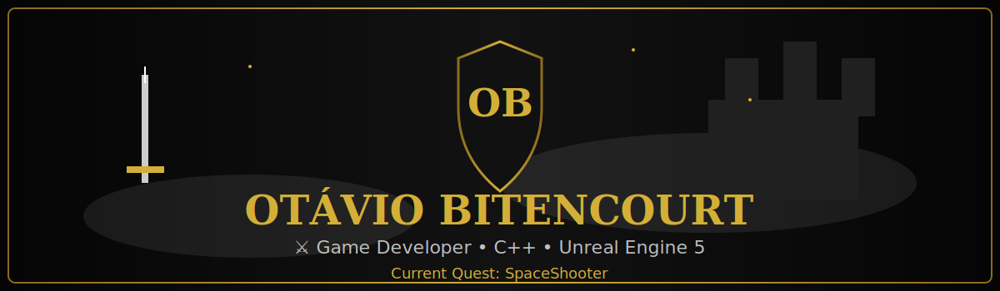

<div align="center">

<p align="center">
  
</p>

<div align="center">


</div>

<div align="center">


</div>

### ⚔ Game Developer • C++ • Unreal Engine 5

*"Every great adventure begins with a single line of code."*

</div>

---

# 🛡 Knight Profile

| Attribute   | Value                     |
| ----------- | ------------------------- |
| ⚔ Class     | Game Developer            |
| 🎓 Rank     | Computer Science Graduate |
| 🏰 Kingdom  | Code Kingdom              |
| 📍 Location | Brazil                    |
| 🟢 Status   | Online                    |

---

# 📜 Current Quest

```txt
MISSION ACTIVE

Project:
► SpaceShooter

Objective:
► Improve gameplay systems
► Expand game mechanics
► Master C++ game development

Ultimate Goal:
► Become a Professional Game Developer
```

---

# ⚔ Attributes

```txt
C++
█████████░ 90%

Unreal Engine 5
████████░░ 80%

Gameplay Programming
████████░░ 80%

Game Design
███████░░░ 70%

Software Engineering
███████░░░ 75%
```

---

# 🏹 Equipment

<p align="center">


</p>

---

# 🏰 Featured Project

## 🎮 SpaceShooter

A 2D Space Shooter developed in C++ using SFML.

Current development focuses on:

* Gameplay Systems
* Enemy Behaviors
* Game Architecture
* Performance Improvements

---

# 📈 Kingdom Statistics

<p align="center">


</p>

---

# ⚔ Campaign History

<p align="center">


</p>

---

# 📬 Contact

<p align="center">

[](mailto:ssotaviobb@gmail.com)
[](https://www.instagram.com/ot_s16/)
[](https://www.linkedin.com/in/ot%C3%A1vio-bitencourt-silva-ba44b8255/)


</p>

---


<picture align="center">
  <source media="(prefers-color-scheme: dark)" srcset="https://raw.githubusercontent.com/galaxyhf/galaxyhf/output/github-contribution-grid-snake-dark.svg">
  <source media="(prefers-color-scheme: light)" srcset="https://raw.githubusercontent.com/galaxyhf/galaxyhf/output/github-contribution-grid-snake-dark.svg">
  
</picture>
